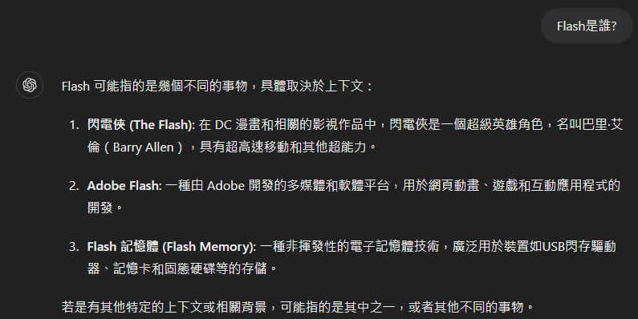

# 我的 GPT 介紹

2024 by Flash

---

# Self-introduction

---





---

# 自我介紹 Demo

---

# 小遊戲

玩法: 大家站起來玩遊戲做選擇
失敗: 就坐下來

---

文字接龍: 下一個字是什麼?
# 明... ?

選: "明" 的人站左邊 
選: "天" 的人站右邊

---

下一個字是什麼?
# 明明... ?

選: "白" 的人站左邊
選: "是" 的人站右邊

---

下一個字是什麼?
# 明明白... ?

選: "白" 的人站左邊
選: "色" 的人站右邊

---

下一個字是什麼?
# 明明白色... ?

選: "是" 的人站左邊
選: "就" 的人站右邊

---

下一個字是什麼?
# 明明白色就... ?

選: "是" 的人站左邊
選: "有" 的人站右邊

---

### 文字接龍的答案是

# 明明白色就有我的最愛... 

---

# 解釋 GPT 原理 (Video) 

----

# 為什麼要有私有 AI ?

### 因為我們不想讓別人知道自己有個秘密

---

# Astro 阿童木 (原子小金剛)

它是一部科幻題材作品，也是 Flash 歷年來最具挑戰性的作品，於2023年12月誕生。這部作品擁有七種特殊能力……


---

### Astro 第一版
* 只支援英文
* 只能在 windows command 視窗下輸入問題
* 最後考試測驗獲得 60 分(考10題, 答對6題, 錯4題)
* 每當有新的問題要再訓練一次

---

錯四題原因:
- 一題: 我不小心將錯誤答案輸入到訓練的資料中, 導致答錯
- 一題: 我只給正確的答案一半內容 (當時我不知道還要補充更完整的答案)
- 二題: 我沒提供資料(老闆問了課本以外的內容), AI 就編寫錯誤答案

### 非敗之罪, 何患無辭

---

### Astro 第二版
* ~~只支援英文~~
* ~~只能在 windows command 視窗下輸入問題~~ 

---

# Demo 資料庫 Schema
```sql
CREATE TABLE [dbo].[BankAccount] (
    [custid]      INT            NOT NULL,
    [username]    NVARCHAR (50)  NULL,
    [type]        INT            NULL,
    [description] NVARCHAR (150) NULL,
    [currency]    INT            NULL,
    [tstamp]      ROWVERSION     NULL,
    PRIMARY KEY CLUSTERED ([custid] ASC)
);

```
將上面轉為 C# DTO Class

---

### Astro 第二版
* ~~最後考試測驗獲得 60 分(考10題, 答對6題, 錯4題)~~ 

---

# Demo 

### Alisha 的不為人知的才能是什麼?

---

Alisha 從國小就開始練單輪車, 現在會騎單輪車, 只是我不知道厲害到甚麼程度? 有厲害到能騎單輪車走鋼索的境界嗎? 你可以考慮與她進行更深入的交流，或詢問她的親近朋友和家人。

---

### Astro 第二版
* ~~每當有新的問題要再訓練一次~~

---

~~每當有新的問題要再訓練一次~~
~~有人要求: 今天的問題留着明天回答~~ 
有人要求: 現在的問題留着下一秒回答 
# Add QA Demo 

---

### Astro 第二版的特殊才能是甚麼?

---

# 問題: 大家都不想也很懶惰, 不想一問一答的方式教(打)小孩

---

# Add 大量文件 Demo

---

<span style="font-size:20px;">
台灣在 2024 年四月底正式開賣搭載 M3 晶片的 MacBook Air 13 吋及 15 吋，外型與前一代 M2 版本並沒有差異，主要升級之處就是換上 M3 晶片，以及支援 Wi-Fi 6E 與雙螢幕顯示，特別是可外接雙螢幕，讓 MacBook Air 在多工處理時，可以有更大、更多的螢幕，看得更清楚。另外，也特別強調 AI 應用，但究竟哪裡 AI？

雖說 Apple 已發布 M4 晶片，並搭載於 iPad Pro 13 吋上，但新款 MacBook Air 最大特色還是在升級 M3 晶片，M4 晶片搭載在 MacBook 系列的時間還需再等等。而相較於前一代 M2 晶片，M3 晶片採用 3 奈米製程技術、新一代 GPU 架構、更高效能的 CPU、更快的神經網路引擎⋯等，升級幅度不少，也是 AI 應用的重要核心。另外，在 MacBook Air 13 吋及 15 吋上，只有 M3 晶片可以選擇，沒有 M3 Pro 及 M3 Max 晶片版本，這也呼應了 MacBook Air 的產品定位。

GPU 加動態快取及光線追蹤
M3 系列晶片中最顯著的改變，就是採用全新的 GPU 核心，並且藉由動態快取（Dynamic Caching）設計，藉此讓顯示效能提升，預估會比 M1 快 65%，比  M2快 20%，並加入網格著色（Mesh Shading）、即時光影追蹤（Ray Tracing）技術，讓畫面更為逼真及寫實。

當中，動態快取功能，會依不同運算需求去動態調整 GPU 所需要的快取記憶體，讓每項運算的任務都能使用確切的記憶體需求，不浪費及閒置用不到的快取記憶體，如此在較需要更高效能運算的軟體及遊戲中，就能獲得更多的快取記憶體空間，發揮 GUP 的最佳效能。

此外，也加入光線追蹤技術，這也是 M 系列晶片首次讓硬體加速光線追蹤功能應用在 Mac 上。透過光線追蹤將光線與場景互動時的屬性進行建模，使 App 能夠打造更逼真並符合物理特性的圖像。而新的渲染功能，能夠為幾何處理帶來更高的效率，實現更細緻的場景。

新 CPU 架構提升效能與效率
M3 系列晶片中也針對 CPU 效能和節能核心進行架構的更新，效能核心將比M1 系列晶片更快約 30%、比 M2 系列晶片快約 15%；節能核心也比 M1 系列晶片更快約 50%、比 M2 系列晶片快 30%，因此在執行日常使用的程式時會比以往更快，同時使系統能夠最大限度地延長電池續航力。因此，在 M3 系列晶片中，可用一半功耗帶來與 M1 相同的多執行緒能，也就是說 CPU 每瓦效能比 M1 系列提高約 1 倍，而 GPU 每瓦效能也比 M1 提升 1 倍。

5 個 15 吋 MacBook Air 特色：15.3 吋瀏海螢幕、六揚聲器音響系統、1.15 公分薄型機身
一直以來，MacBook Air 的產品線在 MacBook 中最受歡迎，一來機身輕薄，二來價格相對便宜，是許多人購入 MacBook 的首選，而 13 吋的便攜性自然較 15 吋來得高，不過以 15 吋的大螢幕，對於有大量圖片或影片編輯類型的工作來說，可以提供更舒服的螢幕畫面，又或是偏愛大螢幕又想要有輕薄輕身的用戶，15 吋 MacBook Air 就會是不錯的選擇，以下則整理 5 個 15 吋 MacBook Air 的重要特色，即使外型就像 13 吋的放大版，但細節處還是有所差異。

特色 1：15.3 吋 Liquid Retina 顯示器
要說 15 吋 MacBook Air 最大特色，當然是配置 15.3 吋 Liquid Retina 顯示器，並與 13 吋 MacBook Air 一樣，採用窄邊框設計，讓螢幕左右邊框及上邊框約為 5mm，且維持著「瀏海」設計，因此螢幕尺寸在計算上來到 15.3 吋，而在瀏海裡是 1080p 的視訊攝影機，但沒有提供 Face ID，也沒有提供人物居中功能。

在螢幕規格部分，提供 2880x1864 解析度，透過 Liquid Retina 顯示器的特性，讓顯示器可以貼合機身的弧線，於螢幕邊角也會延展為圓角呈現。此外，螢幕使用 P3 廣色域，支援 10 億種色彩，也具備原彩顯示技術，可依當下環境光源，調整最適合的白平衡，至於亮度則為 500 尼特，這部分也與 13 吋 MacBook Air 相當。

特色 2：厚度 1.15 公分、重量 1.51 公斤
MacBook Air 的外型特色就是輕薄，以 1.15 公分的厚度，也只比 13 吋的MacBook Air 多了 0.02 公分，這點相當難得，且與市售 15 吋筆電相比，外型絕對是極薄的設計。至於重量部分，因為全機採用全鋁金屬一體成型機身，重量為 1.51 公斤，雖然也不算太重，但當前不少強調極致輕薄的 Windows 筆電，大都會以鋁鎂合金打造，讓重量少於 1 公斤，因此，15 吋 MacBook Air 在重量上並不算有優勢。

不過，不得不說，15 吋的 MacBook Air 機身配重相當好，拿在手上時會感受到機身紮實、配重平均，即使少了貼身攜帶的機動性，但仍保有方便的移動性。另外，與 M2 版本一樣，推出四種顏色可選擇，除了銀色和太空灰色之外，也有午夜色和星光色，當中，午夜色強調採用突破性陽極處理密封技術，可減少指紋沾染的問題。

特色  3：出色的六揚聲器音響系統
除了大尺寸螢幕之外，15 吋 MacBook Air 配置六揚聲器音響系統，以提供更突出的音效表現。

13 吋 MacBook Air 是配置四揚聲器音響系統，即兩個低音喇叭與兩個高音喇叭，而 15 吋 MacBook Air 的六揚聲器音響系統，即兩對振動抑制低音喇叭與兩個高音喇叭，並支援空間音訊及杜比全景聲功能。實際在播放影片及遊戲，無論音量及音效，都比 13 吋 MacBook Air 出色，特別是空間音訊下能感受到環繞效果。

特色 4：大容量電池與雙 USB-C 埠充電器
由於 15 吋 MacBook Air 螢幕尺寸較大，自然會想到較耗電的問題，而 15 吋MacBook Air 配置的電池規格為 66.5Wh，相比 13 吋 MacBook Air 的 52.6Wh 還大，因此在 Apple 公布的續航力表現部分，同樣可以達到 15 小時無線上網、18 小時 Apple TV 播放時間，表現也與 13 吋 MacBook Air 一樣。

另外，15 吋 MacBook Air 隨產品提供的充電器有兩種可選擇，一個是 35W 雙 USB-C 埠小型電源轉接器，可同時為兩台裝置進行充電；另一個因應 MacBook Air 支援快充，因此提供 70W USB-C 電源轉接器，兩款可二選一，且不用加價，用戶只要依需求選擇雙埠充電還是快充即可。

特色 5：機身 100% 再生鋁金屬
M3 版的 MacBook Air 更強調綠色製造，也是 Apple 首款採用 50% 再生成分製造的產品，其中機身及主機板採用 100% 再生鋁金屬，磁石採用 100% 再生稀土元素，而且不含汞、溴化阻燃劑和聚氯乙烯（PVC），並符合 ENERGY STAR 能源效率認證。此外，包裝更是採用 99% 纖維材料，使 Apple 更接近在 2025 年前淘汰所有塑膠包裝的目標。
</span>

---

Q: MacBook Air 有幾公斤?
Q: MacBook Air 的視訊攝影機是多少P ?

---

# 總結: Astro 第二版
* 可以在網站頁面上輸入中英問題
* 對於不知道的問題, 能夠回答我不知道
* 可以即時補充QA
* 可以即時補充文件(減少 QA 負擔)

---

# 開發 AI 的困難點
三個元素 (資料, 算力, 模型) 成就了 AI
* 資料: 需要大量的QA (就像一本書: 十萬個為什麼?)
* 算力: 訓練/微調模型, 需要大量的記憶體和運算速度.
* 模型: 模型的大小越大越好, 除非改進模型的結構

---

# END

下一版....我將加上特殊才能