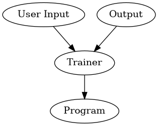

# 人工智慧


通過分析和理解大量的資料，從中學習並提取知識來推理、解決問題和做出決策。


---
# 甚麼是 "寫程式" ?

輸入資料進入程式後，透過結構化的指令或命令進行複雜的運算，最終產生輸出資料


```ditaa {cmd=true args=["-E"]}
+----------+   +---------+    +-------+
|User Input|-->| Program |--->|Output |
|       {d}|   |         |    |       |
+----------+   +---------+    +-------+
```

---

# 範例
Case 1: Input 1 --> Program --> 1
Case 2: Input 2 --> Program --> 2
Case 3: Input 3 --> Program --> 3


---

```
function program(x) {
  return x;
}
```


Q: 如何寫這個 Program ?


# 範例
Case 1: Input 1 --> Program --> 2
Case 2: Input 2 --> Program --> 3
Case 3: Input 3 --> Program --> 4

Q: 如何寫這個 Program ?


```
function program(x) {
  return x + 1;
}
```





```Vega-Lite
{
  "$schema": "https://vega.github.io/schema/vega-lite/v5.json",
  "data": {
    "values": [
      {"x": 1, "y": 1},
      {"x": 2, "y": 2},
      {"x": 3, "y": 3},
      {"x": 4, "y": 4}
    ]
  },
  "mark": {"type": "point", "filled": true},
  "encoding": {
    "x": {"field": "x", "type": "quantitative"},
    "y": {"field": "y", "type": "quantitative"},
    "color": {"value": "steelblue"}
  }
}
```


```Vega-Lite
{
  "$schema": "https://vega.github.io/schema/vega-lite/v5.json",
  "data": {
    "values": [
      {"x": 1, "y": 1},
      {"x": 2, "y": 2},
      {"x": 3, "y": 3},
      {"x": 4, "y": 4}
    ]
  },
  "layer": [
    {
      "mark": {"type": "point", "filled": true},
      "encoding": {
        "x": {"field": "x", "type": "quantitative"},
        "y": {"field": "y", "type": "quantitative"},
        "color": {"value": "steelblue"}
      }
    },
    {
      "mark": {"type": "line"},
      "encoding": {
        "x": {"field": "x", "type": "quantitative"},
        "y": {"field": "y", "type": "quantitative"}
      }
    }
  ]
}

```


```javascript {cmd="node"}
class Neuron {
  constructor() {
    this.weight = 0;
    this.bias = 0;
  }

  forward(input) {
    let output = input * this.weight + this.bias;
    return this.activationFunction(output);
  }

  backward(input, output, target, learningRate) {
    const loss = target - output;
    //const gradient = loss * this.activationFunctionDerivative(output); 
    const gradient = loss * output * (1 - output);

    this.weight += input * gradient * learningRate;
    this.bias += gradient * learningRate;
    console.log(`${input} ${output} g=${gradient} lost=${loss} t=${target} w=${this.weight} b=${this.bias}`)
  }

  activationFunction(x) {
    return 1 / (1 + Math.exp(-x));
  }

  activationFunctionDerivative(x) {
    const sigmoid = 1 / (1 + Math.exp(-x));
    return sigmoid * (1 - sigmoid); // sigmoid函数的导数
  }
}

const neuron = new Neuron();
// 定義輸入和目標值
let inputs = [1, 2, 3];
let targets = [2, 3, 4];
for(let i=1; i<100; i++) {
  inputs[i] = i + 1;
  targets[i] = inputs[i] + 1;
}

const learningRate = 0.001;
for(let epoch=0; epoch<100; epoch++) {
  for (let i = 0; i < inputs.length; i++) {
    const input = inputs[i];
    const output = neuron.forward(input);
    neuron.backward(input, output, targets[i], learningRate);
  }
}

const result = neuron.forward(5);
console.log(neuron.weight, neuron.bias)
console.log('result', result);
```


```javascript {cmd="node"}
class Neuron {
  constructor() {
    this.weights = [];
    this.bias = 0;
  }

  forward(input) {
    let sum = 0;
    for (let i = 0; i < input.length; i++) {
      sum += input[i] * this.weights[i];
    }
    sum += this.bias;
    return this.activationFunction(sum);
  }

  backward(input, output, target, learningRate) {
    const error = target - output;
    for (let i = 0; i < input.length; i++) {
      this.weights[i] += input[i] * error * learningRate;
    }
    this.bias += error * learningRate;
  }

  activationFunction(x) {
    return 1 / (1 + Math.exp(-x));
  }
}


const neuron = new Neuron();

// 定義輸入和目標值
const input = [0.5, 0.3, 0.8];
const target = 1;

// 向前傳播計算輸出值
const output = neuron.forward(input);

// 向後傳播更新權重和偏差
const learningRate = 0.1;
neuron.backward(input, output, target, learningRate);
```


身分證驗證碼

```vega-lite
{
  "$schema": "https://vega.github.io/schema/vega-lite/v5.json",
  "data": {
    "values": [
      {"x": 1, "y": 1},
      {"x": 2, "y": 2},
      {"x": 3, "y": 3},
      {"x": 5, "y": 5}
    ]
  },
  "layer": [
    {
      "mark": {"type": "point", "filled": true},
      "encoding": {
        "x": {"field": "x", "type": "quantitative"},
        "y": {"field": "y", "type": "quantitative"},
        "color": {"value": "steelblue"}
      }
    },
    {
      "mark": {"type": "line"},
      "encoding": {
        "x": {"field": "x", "type": "quantitative"},
        "y": {"field": "y", "type": "quantitative"}
      }
    }
  ]
}
```


```javascript {cmd="node"}
class Neural {
  constructor() {
    this.weight = Math.random();
    this.bias = Math.random();
  }

  forward(input) {
    const neuron = this.sigmoid(input * this.weight + this.bias);
    return neuron;
  }

  backward(input, output, target, learningRate) {
    const error = target - output;
    this.weight += input * error * learningRate;
    this.bias += error * learningRate;
  }

  sigmoid(x) {
    return 1 / (1 + Math.exp(-x));
  }
}

const neuron = new Neuron();
const inputs  = [1, 2, 3];
const outputs = [];

const output = neuron.forward(input);

// 向後傳播更新權重和偏差
const learningRate = 0.1;
neuron.backward(input, output, target, learningRate);
```

```javascript cmd="node"}
class Neuron {
  constructor() {
    // 初始化權重和偏差
    this.weights = [];
    this.bias = 0;
  }

  forward(input) {
    // 向前傳播
    let sum = 0;
    for (let i = 0; i < input.length; i++) {
      sum += input[i] * this.weights[i];
    }
    sum += this.bias;
    return this.activationFunction(sum);
  }

  backward(input, output, target, learningRate) {
    // 向後傳播
    const error = target - output;
    for (let i = 0; i < input.length; i++) {
      this.weights[i] += input[i] * error * learningRate;
    }
    this.bias += error * learningRate;
  }

  activationFunction(x) {
    // 激活函式（例如 sigmoid 函式）
    return 1 / (1 + Math.exp(-x));
  }
}
```


身分證驗證碼

```javascript {cmd="node"}
function convertIdToNumbers(id) {
  let a = id.substr(0, 1).charCodeAt() - 'A'.charCodeAt() + 10;
  let remainder = id.substr(1);
  let numberText = a + remainder;
  return numberText;
}

function calculateChecksum(id) {
  let weights = [1, 9, 8, 7, 6, 5, 4, 3, 2, 1];
  let sum = 0;
  let idNumber = convertIdToNumbers(id)

  for (var i = 0; i < 10; i++) {
    num = idNumber.substr(i, 1);
    n = num.charCodeAt() - '0'.charCodeAt();
    sum += n * weights[i];
  }
  let checksum = 10 - sum % 10;
  return checksum;
}

var id = "A123456789";
var checksum = calculateChecksum(id);
console.log(checksum);
```
