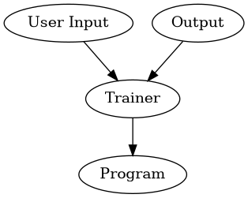

# 人工智慧


通過分析和理解大量的資料，從中學習並提取知識來推理、解決問題和做出決策。


---
# 甚麼是 "寫程式" ?

輸入資料進入程式後，透過結構化的指令或命令進行複雜的運算，最終產生輸出資料


```ditaa {cmd=true args=["-E"]}
+----------+   +---------+    +-------+
|User Input|-->| Program |--->|Output |
|       {d}|   |         |    |       |
+----------+   +---------+    +-------+
```

---

# 範例
Case 1: Input 1 --> Program --> output 1
Case 2: Input 2 --> Program --> output 2
Case 3: Input 3 --> Program --> output 3


---

```
function program(x) {
  return x;
}
```


Q: 如何寫這個 Program ?


# 範例
Case 1: Input 1 --> Program --> output 2
Case 2: Input 2 --> Program --> output 3
Case 3: Input 3 --> Program --> output 4

Q: 如何寫這個 Program ?


```
function program(x) {
  return x + 1;
}
```


這是描述 y = x + 1 的二維散點圖，以清晰地呈現它們之間的關係。

```Vega-Lite
{
  "$schema": "https://vega.github.io/schema/vega-lite/v5.json",
  "data": {
    "values": [
      {"x": 1, "y": 1,
      {"x": 2, "y": 2,
      {"x": 3, "y": 3,
      {"x": 4, "y": 4}
    ]
  ,
  "mark": {"type": "point", "filled": true,
  "encoding": {
    "x": {"field": "x", "type": "quantitative",
    "y": {"field": "y", "type": "quantitative",
    "color": {"value": "steelblue"}
  }
}
```

通過觀察，我們可以發現這個方程 y = x + 1 具有線性關係。這意味著 x 和 y 之間存在著一條直線的關係。


```Vega-Lite
{
  "$schema": "https://vega.github.io/schema/vega-lite/v5.json",
  "data": {
    "values": [
      {"x": 0, "y": 0,
      {"x": 1, "y": 1,
      {"x": 2, "y": 2,
      {"x": 3, "y": 3,
      {"x": 4, "y": 4}
    ]
  ,
  "layer": [
    {
      "mark": {"type": "point", "filled": true,
      "encoding": {
        "x": {"field": "x", "type": "quantitative",
        "y": {"field": "y", "type": "quantitative",
        "color": {"value": "steelblue"}
      }
    ,
    {
      "mark": {"type": "line",
      "encoding": {
        "x": {"field": "x", "type": "quantitative",
        "y": {"field": "y", "type": "quantitative"}
      }
    }
  ]
}

```


## 問題
>## 為什麼你會知道上面的 program 方法的實作是 return x + 1 ?
## 我們是如何推導出來的?

```
return x * weight + bias;
```

為了讓這個函數更靈活一點, 我們可以加上兩個參數 weight, bias

weight 權重代表著神經元對不同輸入的重視程度。較大的權重表示對應輸入的影響力更大，而較小的權重表示影響力較小。

bias 是偏差數值，它不依賴於任何輸入。偏差的作用是調整神經元對於整體輸入的敏感度。偏差可以看作是神經元對於某種特定輸入的基本反應能力.





```javascript {cmd="node"}
class Neuron {
  constructor() {
    this.weight = Math.random();
    this.bias = Math.random();
  }

  forward(input) {
    return input * this.weight + this.bias;
  }

  backward(input, output, target, learningRate) {
    const loss = target - output;
    //console.log(`loss=${loss}`)
    this.weight += input * loss * learningRate;
    this.bias += loss * learningRate;
  }
}

const neuron = new Neuron();

// 定義輸入和輸出值
let inputs = [1, 2, 3];
let targets = [2, 3, 4];

//開始訓練
const learningRate = 0.001;
for(let epoch=0; epoch<1000; epoch++) {
  for (let i = 0; i < inputs.length; i++) {
    const input = inputs[i];
    const output = neuron.forward(input);
    neuron.backward(input, output, targets[i], learningRate);
  }
}

const input = 5;
const result = neuron.forward(input);
console.log(`${input} = ${result}`);
```

error表示誤差，input表示輸入，learningRate表示學習速率。這個運算式 this.weight += input * error * learningRate; 表示將權重(weight)與誤差(error)相乘，再乘以學習速率(learning rate)，最後將結果加到原始的權重上。

這樣做的目的是根據誤差的大小和方向，調整權重的值。如果誤差越大，那麼更新的幅度也會越大，這樣可以加快收斂的速度。而學習速率則控制著每次更新的大小，避免更新過快或過慢。


```javascript {cmd="node"}
function convertIdToNumbers(idStr) {
  let numbers = [];
  let a = idStr.substr(0, 1).charCodeAt() - 'A'.charCodeAt() + 10;
  numbers.push(a);
  //console.log('first', idStr.substr(0, 1), a);

  for(let i=1; i<idStr.length; i++) {
    let numStr = idStr.substr(i, 1);
    let num = numStr.charCodeAt() - '0'.charCodeAt();
    numbers.push(num);
  }
  return numbers;
}

class Neuron {
  constructor(n) {
    this.weights = [];
    for(let i=0; i<n; i++) {
      this.weights.push(Math.random());
    }
    this.bias = Math.random();
  }

  forward(inputs) {
    let sum = 0;
    for (let i = 0; i < inputs.length; i++) {
      sum += inputs[i] * this.weights[i];
    }
    sum += this.bias;
    return sum;
  }

  backward(inputs, output, target, learningRate) {
    const error = target - output;
    for (let i = 0; i < inputs.length; i++) {
      this.weights[i] += inputs[i] * error * learningRate;
    }
    this.bias += error * learningRate;
  }
}


const neuron = new Neuron();

// 定義輸入和目標值
const ids = ["E1735036210","R278834622","B237836243","D244273034","O2019822310","Y271964122","C239484837","P263820767","G231218906","B190165729","K124550463","E184776282","X286428383","B220160145","C289788862","P164150628","C1212528110","C181628116","R279811516","Q268712083","S299458141","F163801352","P255264157","K198937994","X209957734","F120852882","H220807345","X275488186","D185707646","A275091372","K155181836","U289953935","B195715372","K1531103210","N1678480810","E1675126410","H161935964","B2530905510","S170272496","A131231287","G237413996","K234703147","U158095979","C222408087","H225286891","F1460663410","O295989885","V263650743","K243702176","O2043132010"];

const inputs = ids.map(x => convertIdToNumbers(x).slice(0, 9))
const targets = ids.map(x =>convertIdToNumbers(x).slice(9)[0])
// 向前傳播計算輸出值
// const output = neuron.forward(input);
// const learningRate = 0.1;
// neuron.backward(input, output, target, learningRate);
```


身分證驗證碼

```javascript {cmd="node"}
function convertIdToNumbers(id) {
  let a = id.substr(0, 1).charCodeAt() - 'A'.charCodeAt() + 10;
  let remainder = id.substr(1);
  let numberText = a + remainder;
  return numberText;
}

function calculateChecksum(id) {
  let weights = [1, 9, 8, 7, 6, 5, 4, 3, 2, 1];
  let sum = 0;
  let idNumber = convertIdToNumbers(id)

  for (var i = 0; i < 10; i++) {
    num = idNumber.substr(i, 1);
    n = num.charCodeAt() - '0'.charCodeAt();
    sum += n * weights[i];
  }
  let checksum = 10 - sum % 10;
  return checksum;
}

var id = "M185585395";
var checksum = calculateChecksum(id);
console.log(checksum);
```


```javascript {cmd="node"}
function convertIdToNumbers(id) {
  const first = {
    'A': 10 ,
    'B': 11 ,
    'C': 12 ,
    'D': 13 ,
    'E': 14 ,
    'F': 15 ,
    'G': 16 ,
    'H': 17 ,
    'I': 34 ,
    'J': 18 ,
    'K': 19 ,
    'L': 20 ,
    'M': 21 ,
    'N': 22 ,
    'O': 35 ,
    'P': 23 ,
    'Q': 24 ,
    'R': 25 ,
    'S': 26 ,
    'U': 28 ,
    'V': 29 ,
    'W': 32 ,
    'X': 30 ,
    'Y': 31 ,
    'Z': 33 ,
  }
  let a = first[id.substr(0, 1)];
  let remainder = id.substr(1);
  let numberText = `${a}` + remainder;
  return numberText;
}

function calculateChecksum(idNumbers) {
  let weights = [1, 9, 8, 7, 6, 5, 4, 3, 2, 1];
  let sum = 0;

  for (var i = 0; i < 10; i++) {
    num = idNumbers.substr(i, 1);
    n = num.charCodeAt() - '0'.charCodeAt();
    sum += n * weights[i];
  }
  let checksum = 10 - sum % 10;
  return checksum;
}


function generateRandomID() {
  var firstChar = String.fromCharCode(65 + Math.floor(Math.random() * 26));
  
  var secondNum = Math.floor(Math.random() * 2) + 1;
  
  let nums = '';
  for (var i = 0; i < 7; i++) {
    num = Math.floor(Math.random() * 10);
    nums += `${num}`;
  }
  
  // 計算檢查碼
  let str = `${firstChar}${secondNum}${nums}`;
  let idNumbers = convertIdToNumbers(str);
  let checkCode = calculateChecksum(idNumbers);

  let id = str + checkCode;
  return id;
}

let idArray = [];
for(let i=0; i<50; i++) {
  let id = generateRandomID();
  idArray.push(id);
}
console.log(JSON.stringify(idArray));
```


