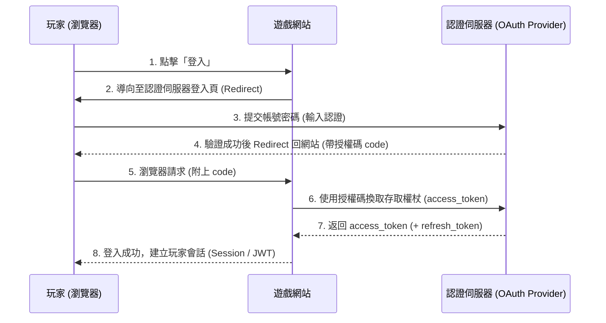

```mermaid
sequenceDiagram
    participant Player as 玩家 (瀏覽器)
    participant WebSite as 遊戲網站
    participant Auth as 認證伺服器 (OAuth Provider)

    Player->>WebSite: 1. 點擊「登入」
    WebSite->>Player: 2. 導向至認證伺服器登入頁 (Redirect)
    Player->>Auth: 3. 提交帳號密碼 (輸入認證)
    Auth-->>Player: 4. 驗證成功後 Redirect 回網站 (帶授權碼 code)
    Player->>WebSite: 5. 瀏覽器請求 (附上 code)
    WebSite->>Auth: 6. 使用授權碼換取存取權杖 (access_token)
    Auth-->>WebSite: 7. 返回 access_token (+ refresh_token)
    WebSite-->>Player: 8. 登入成功，建立玩家會話 (Session / JWT)
```