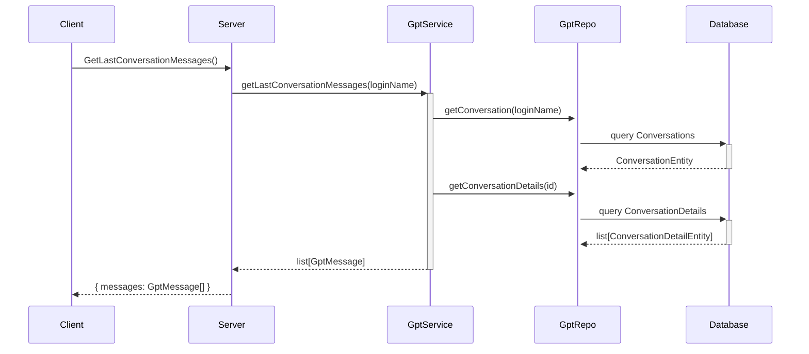

```mermaid
sequenceDiagram
    Client ->> Server: GetLastConversationMessages();
    Server ->> +GptService: getLastConversationMessages(loginName);
    GptService ->> +GptRepo: getConversation(loginName);
    GptRepo ->> +Database: query Conversations; Database -->> -GptRepo: ConversationEntity ;
    GptService ->> GptRepo: getConversationDetails(id);
    GptRepo ->> +Database: query ConversationDetails ; Database -->> -GptRepo: list[ConversationDetailEntity] ;
    GptService -->> -Server: list[GptMessage];
    Server -->> Client: { messages: GptMessage[] };
```